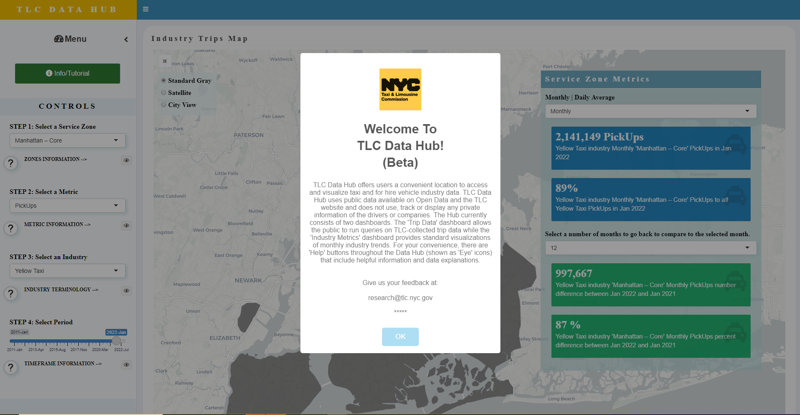
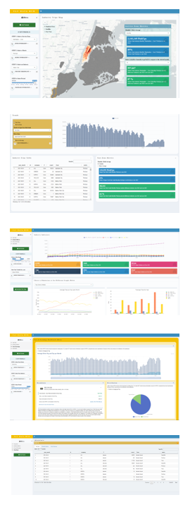

# TLC DATA HUB RShiny APP

## Check It Out

- Try a demo of the app on [DataHub].

## Overview

TLC Data Hub offers users a convenient location to access and visualize taxi and for hire vehicle industry data.  TLC Data Hub uses public data available on Open Data and the TLC website and does not use, track or display any private information of the drivers or companies. The Hub currently consists of three dashboards and a databank. The 'Trip Data' dashboard allows the public to run queries on TLC-collected trip data while the 'Industry Metrics' dashboard provides standard visualizations of monthly industry trends. For your convenience, there are 'Help' buttons throughout the Data Hub (shown as 'Eye' icons) that include helpful information and data explanations.

Currently, the app includes the following dashboards:

- &#x1F4C8; **Dashboard** 

    The 'Trip Data' dashboard displays and compares the pickup, dropoff, trip, trip fare, trip time, and trip distance data across different locations, industries and periods.
    
    All the selections that you've made in the control panel will be represented on the map and info box. The info box allows you to switch between the monthly and daily levels of data.
    
- &#x1F3C6; **High Score** 

    The high score tab gives a "leaderboard" for users, hashtags, words, and emojis for tweets about the conference. This can be a fun way to gauge topics of disucssion, attendee or participant experiences, or to motivate users to participate.

- &#x1F3B0; **Tweet Wall** 

    The **Tweet Wall** shows all of the tweets from the conference in a Pinterest-style wall. Users can quickly scan and read the stream of tweets from the conference or event. Additional, configurable date filters allow users to look for tweets from particular date ranges.

- &#x1F4F8; **Media Tweet Wall** 

    The _Media Tweet Wall_ is another wall of tweets containing only tweets with pictures or videos. In addition to the occasional gif, this tab provides an overview of the pictures being published from the conference venue.

- &#x1F50D; **Searchable Table of Tweets** 

    It is notoriously difficult to use Twitter's search features to find specific tweets. The **Explore** tab provides a searchable [dataTable] of tweets with a number of pre-specified filters. Users can search for text in any field or sort by date or number of favorites or likes. Clicking on a tweet in the table shows the tweet alongside the table in its original context.
    
- &#x1F4C6; **Conference Schedule**

    Conference schedules also tend to be difficult to search and interact with. But if a downloadable (or scrapable) conference schedule is available, it can be embedded directly into the app with the full search and ordering capabilities of [dataTables]. If a tidy schedule table isn't available, the tab's link can point directly to the conference or event schedule on an external website.
    
- &#x1F4F1; **Looks Great on Mobile**

    The dashboard is built on [AdminLTE] and [Bootstrap] with a fully responsive design. All of the main features work well on mobile — including the landing page, the high scores and the walls of tweets. The tabs that use [dataTables] try hard, too!
    
## &#x1F64F; Thank you!

This dashboard was built using many great tools in the R ecosystem. Thanks to all of the developers of these open source packages:

- [shiny]
- [shinydashboard]
- [plotly]
- [tidyverse]
- [shinycssloaders]
- [DT]

...and many more. For a full list of project dependencies, see [deps.yaml](deps.yaml).
    
---

This dashboard was built by [Nikita Voevodin] and is owned by the NYC Government.

[Open Data]: https://www.youtube.com/watch?v=LJ8YkGjdcuA
[Nikita Voevodin]: https://nikitavoevodin.com
[DataHub]: https://tlcanalytics.shinyapps.io/datahub/
[shinydashboard-fork]: https://github.com/gadenbuie/shinydashboard/tree/dev
[adminlte-ocean-next]: https://github.com/gadenbuie/AdminLTE/tree/ocean-next
[datatable]: https://www.datatables.net/
[datatables]: https://www.datatables.net/
[app-rstudio-cloud]: https://rstudio.cloud/spaces/12362/project/258314
[app-grrrck]: https://apps.garrickadenbuie.com/rstudioconf-2019/
[app-shinyapps]: https://gadenbuie.shinyapps.io/tweet-conf-dash/
[mit-license]: https://choosealicense.com/licenses/mit/
[garrick-home]: https://www.garrickadenbuie.com
[repo]: https://github.com/gadenbuie/tweet-conf-dash/
[shiny]: http://shiny.rstudio.com/
[rtweet]: https://rtweet.info
[shinydashboard]: https://rstudio.github.io/shinydashboard/
[plotly]: https://plot.ly/
[tidyverse]: https://tidyverse.org
[shinycssloaders]: https://github.com/andrewsali/shinycssloaders
[DT]: https://rstudio.github.io/DT/
[adminlte]: https://adminlte.io/
[bootstrap]: https://getbootstrap.com/
